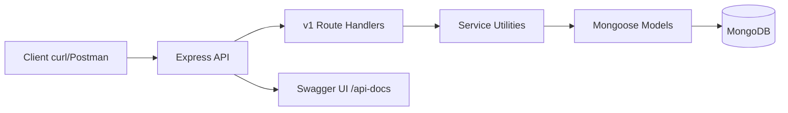
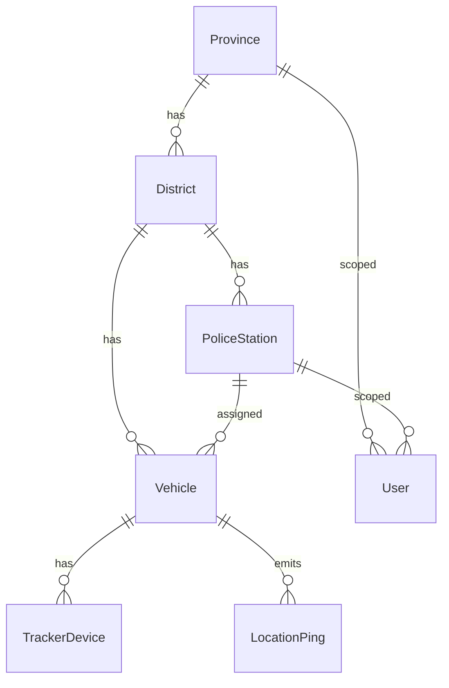
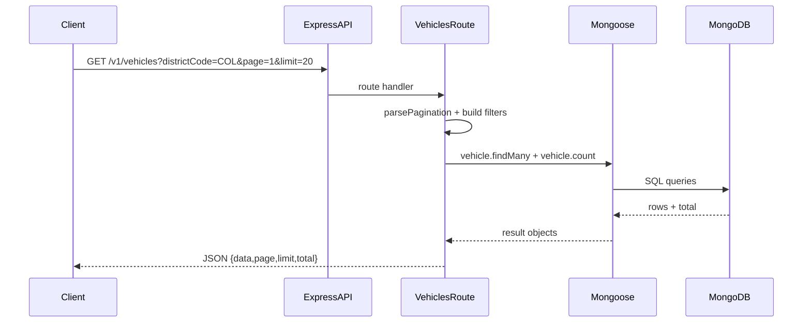
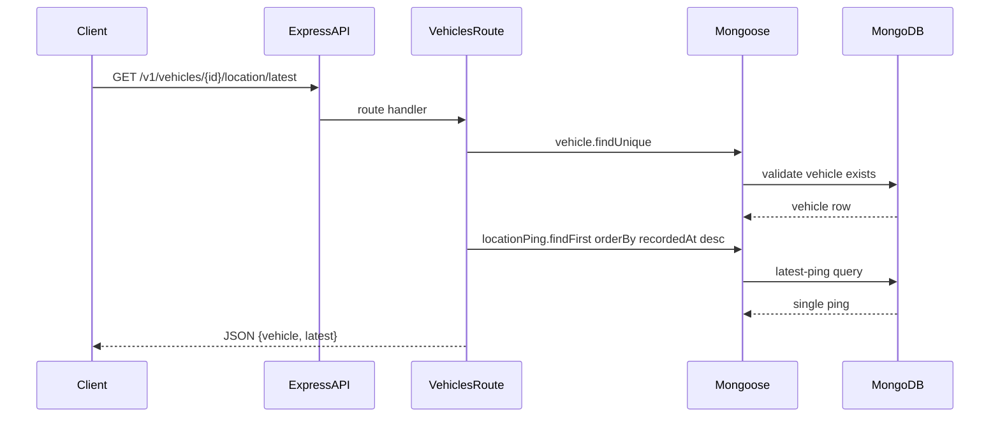

# Tuk-Tuk API Project Architecture Guide

This document explains the full project in one place: what it does, how it is structured, data models, API flows, and how the pieces connect.

---

## 1) Project purpose

This API supports the **initial stage** of a law-enforcement visibility system for Sri Lankan three-wheelers (tuk-tuks):

- Maintain master data: provinces, districts, police stations.
- Maintain operational entities: vehicles, tracker devices, users.
- Store GPS pings from vehicles/devices.
- Serve read APIs for:
  - boundary filtering (province/district/station),
  - vehicle registry listing,
  - latest known location,
  - historical movement logs,
  - basic operational analytics.

Current status:

- **Week 1** complete: schema, migration, simulation seed data, docs.
- **Week 2** complete: Express read API shell + Swagger stubs.
- **Week 3** complete: JWT auth, RBAC scoping, device API-key ingest, admin vehicle writes, OpenAPI security updates.
- Week 4 pending in roadmap (hardening, deploy/report completion).

---

## 2) Technology stack

- **Runtime**: Node.js (ES Modules)
- **API Framework**: Express
- **Database**: MongoDB
- **ODM**: Mongoose
- **Docs UI**: Swagger UI (`/api-docs`)
- **Quality tools**: ESLint + Prettier
- **Local infra**: Docker Compose (MongoDB)

---

## 3) High-level architecture




### Layer responsibilities

- **API layer** (`src/index.js`)
  - HTTP app setup, JSON parsing, CORS, request logging.
  - mounts routes and docs.
  - global not-found and error handlers.
- **Route layer** (`src/routes/v1/*.js`)
  - endpoint definitions and request parsing.
  - query filters, pagination, date-window validation.
  - calls Mongoose model queries.
- **Service helpers**
  - shared MongoDB connection (`src/services/db.js`).
  - common validators (`src/services/query-utils.js`).
- **Persistence**
  - Mongoose schemas + MongoDB collections.

---

## 4) Folder structure and what each part does

```text
src/
  index.js                     # app bootstrap, middleware, route mounting
  openapi.js                   # OpenAPI/Swagger path stubs
  middleware/
    error-handler.js           # notFound + centralized error JSON format
  routes/
    v1/
      index.js                 # combines week-2 route modules
      boundaries.js            # provinces/districts/stations reads
      vehicles.js              # vehicle list/detail/latest/history reads
      analytics.js             # operational aggregate reads
  services/
    db.js                      # MongoDB connection service
    query-utils.js             # pagination and date-range validators

src/models/
  index.js                     # Mongoose schemas and model exports

scripts/
  seed-mongo.js                # deterministic simulation seeding

docs/
  adr/0001-indexing-and-schema.md
  data-dictionary.md
  simulation.md
  project-architecture-guide.md
```

---

## 5) Data model (entities and relationships)

Core ER shape:




### Main models

- **Province**
  - `id`, `code` (unique), `name`
- **District**
  - `id`, `code` (unique), `name`, `provinceId`
- **PoliceStation**
  - `id`, `code` (unique), `name`, `districtId`
- **User**
  - `email`, `passwordHash`, `role` (`HQ_ADMIN`, `PROVINCIAL`, `STATION`)
  - optional scope: `provinceId` or `stationId`
- **Vehicle**
  - `registrationNumber` (unique), `status` (`ACTIVE`, `INACTIVE`, `SUSPENDED`)
  - `districtId` (required), `stationId` (optional)
  - optional `driverName`, `driverLicense`
- **TrackerDevice**
  - `vehicleId`, `apiKeyHash`, `isActive`, `lastSeenAt`
- **LocationPing**
  - `vehicleId`, `recordedAt`, `latitude`, `longitude`, `speedKmh`, `headingDeg`

### Key indexing decision

- `LocationPing` has an index on `vehicleId + recordedAt DESC` for:
  - fast latest-ping lookup,
  - efficient vehicle-history window queries.

---

## 6) Seeded simulation data (what demo data exists)

Seed script (`scripts/seed-mongo.js`) creates:

- 9 provinces,
- 25 districts,
- 26 police stations,
- 200 vehicles,
- 200 tracker devices,
- 3 demo users,
- ~52,800 location pings (8 days, 30-minute intervals, 06:00–22:00 Sri Lanka time window logic converted to UTC storage).

This gives realistic read responses for listing, filtering, latest location, and history endpoints.

---

## 7) API behavior and response conventions

### Base URLs

- `GET /` -> service overview links
- `GET /health` -> health check
- `GET /api-docs` -> Swagger UI
- `GET /v1/...` -> versioned API resources

### Response style

- Success: JSON with `data` + pagination metadata where applicable.
- Errors: centralized format:
  - `code`
  - `message`
  - optional `details`

### Pagination

Many list endpoints use:

- `page` (>=1, default 1)
- `limit` (1..100, default 20)

---

## 8) Implemented endpoints (Week 2)

### Boundary and master-data reads

- `GET /v1/provinces`
- `GET /v1/districts`
- `GET /v1/stations`
- `GET /v1/districts/:districtId/stations`

Supports optional filtering (`provinceId`, `provinceCode`, `districtId`, `districtCode`, `q`) depending on endpoint.

### Vehicle and movement reads

- `GET /v1/vehicles`
- `GET /v1/vehicles/:vehicleId`
- `GET /v1/vehicles/:vehicleId/location/latest`
- `GET /v1/vehicles/:vehicleId/locations?from=...&to=...`

History endpoint validates ISO datetime range and limits maximum window size.

### Operational analytics reads

- `GET /v1/analytics/vehicles-by-district`
  - aggregate active vehicle counts by district.
- `GET /v1/analytics/active-vehicles?minutes=30`
  - vehicles with recent pings in a rolling time window.

---

## 9) Request flow examples

### A) List vehicles by district




### B) Get latest known location




---

## 10) What is not done yet (planned next)

From roadmap:

- **Week 4**
  - security hardening (helmet/rate limits/etc),
  - tests,
  - cloud deployment finalization,
  - demo script and report-aligned documentation polish.

---

## 11) How to run and inspect locally

```bash
cp .env.example .env
docker compose up -d
npm install
npm run db:migrate:dev
npm run db:seed
npm run dev
```

Then open:

- `http://localhost:3000/`
- `http://localhost:3000/health`
- `http://localhost:3000/api-docs`

---

## 12) Viva-friendly explanation points

Use this order when explaining in viva:

1. **Problem scope**: API-only backend for law-enforcement visibility.
2. **Architecture**: Express routes -> Mongoose model layer -> MongoDB.
3. **Data model**: boundaries + vehicles/devices/users + pings.
4. **Performance rationale**: indexed latest/history lookup.
5. **API behavior**: filters, pagination, date-window validation.
6. **Current delivery status**: Week 1-3 complete with seeded realistic data and protected APIs.
7. **Roadmap**: Week 4 hardening/deploy/report.

