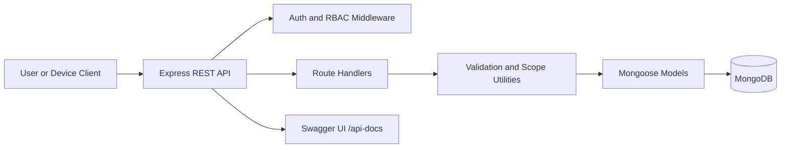
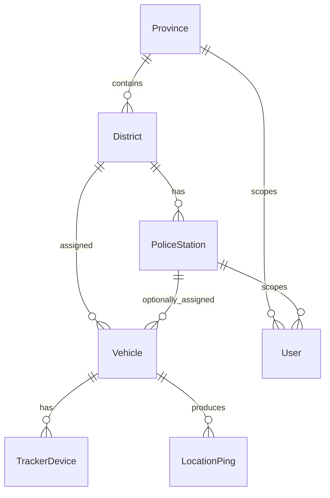

# Tuk-Tuk Tracking API - Final Technical Documentation

Version: 1.0  
Project: NB6007CEM Web API Development Coursework  
System: Real-Time Three-Wheeler Tracking and Movement Logging (API only)

---

## 1. Executive Overview

This project delivers a RESTful Web API for law-enforcement visibility of tuk-tuk movement data in Sri Lanka.  
The API supports:

- administrative geography (provinces, districts, police stations),
- vehicle and tracker-device management,
- secure ingest of GPS pings,
- role-scoped retrieval of latest and historical movement data,
- operational analytics for active vehicles.

The implementation is built with Node.js, Express, MongoDB, and Mongoose, with JWT-based user authentication and API-key based device ingest security.

---

## 2. Scope and Deliverable Boundaries

### In scope

- Backend API only (no web/mobile UI).
- Data modeling and persistence.
- Role-aware access control.
- Synthetic simulation dataset.
- API documentation via Swagger.

### Out of scope

- Client applications.
- Hardware/firmware for devices.
- Advanced GIS map rendering.
- Production-grade SIEM/observability stack integration.

---

## 3. Technology Stack

- Runtime: **Node.js (ES modules)**
- HTTP framework: **Express**
- Database: **MongoDB**
- ODM: **Mongoose**
- Authentication: **JWT** (users), API key (devices)
- Password / key hashing: **bcryptjs**
- API docs: **swagger-ui-express**
- Tooling: **ESLint**, **Prettier**
- Local infrastructure: **Docker Compose**

---

## 4. Solution Architecture

### 4.1 Logical architecture



### 4.2 Layer responsibilities

- **Bootstrap layer (`src/index.js`)**
  - Initializes middleware and route mounting.
  - Exposes root, health, docs, and versioned API routes.
  - Handles not-found and centralized errors.
- **Middleware layer (`src/middleware`)**
  - Error handling (`error-handler.js`)
  - Authentication and authorization (`auth.js`)
- **Route layer (`src/routes/v1`)**
  - Auth endpoints
  - Boundary/master-data endpoints
  - Vehicle and movement endpoints
  - Analytics endpoints
  - Device ingest endpoints
- **Service layer (`src/services`)**
  - Shared Mongoose model layer
  - Query validation
  - Scope composition utilities
- **Persistence layer (`src/models`, `scripts`)**
  - Mongoose schema definitions
  - MongoDB collections
  - Deterministic seed generation

---

## 5. Data Model and Domain Design

### 5.1 Entity relationships



### 5.2 Core entities

- `Province` (`code`, `name`)
- `District` (`code`, `name`, `provinceId`)
- `PoliceStation` (`code`, `name`, `districtId`)
- `User` (`email`, `passwordHash`, `role`, optional `provinceId`/`stationId`)
- `Vehicle` (`registrationNumber`, `status`, `districtId`, `stationId`, driver fields)
- `TrackerDevice` (`vehicleId`, `apiKeyHash`, `isActive`, `lastSeenAt`)
- `LocationPing` (`vehicleId`, `recordedAt`, `latitude`, `longitude`, speed/heading optional)

### 5.3 Indexing strategy

Primary performance index:

- `LocationPing(vehicleId, recordedAt DESC)`

This supports:

- fast latest-location lookup,
- efficient time-window history reads.

Additional indexes exist on key foreign keys and status filters for list queries.

---

## 6. Security Architecture

### 6.1 User authentication

- Endpoint: `POST /v1/auth/login`
- Input: email + password
- Output: JWT access token (Bearer)
- Token claims include:
  - `sub` (user id),
  - `role`,
  - optional scope attributes (`provinceId`, `stationId`).

### 6.2 Role-based access control (RBAC)

Roles:

- `HQ_ADMIN`: unrestricted scope.
- `PROVINCIAL`: restricted to assigned province.
- `STATION`: restricted to assigned station.

Scope rules are enforced in route queries using composable where-clauses.

### 6.3 Device authentication

- Ingest endpoint: `POST /v1/devices/:deviceId/pings`
- Header required: `x-device-key`
- Validation:
  - device exists and is active,
  - provided key matches bcrypt hash.

### 6.4 Input and abuse safeguards

- Coordinate range validation.
- Timestamp sanity checks (future skew / stale data limits).
- Basic per-device minimum interval protection to reduce ping flooding.
- Centralized structured error responses.

---

## 7. API Specification and Endpoint Catalog

### 7.1 Base utility endpoints

- `GET /` service metadata and navigation links
- `GET /health` service health check
- `GET /api-docs` Swagger UI

### 7.2 Auth

- `POST /v1/auth/login`

### 7.3 Boundary/master data (JWT protected)

- `GET /v1/provinces`
- `GET /v1/districts`
- `GET /v1/stations`
- `GET /v1/districts/:districtId/stations`

### 7.4 Vehicles and movement (JWT protected)

- `GET /v1/vehicles`
- `GET /v1/vehicles/:vehicleId`
- `POST /v1/vehicles` (HQ_ADMIN, PROVINCIAL)
- `PATCH /v1/vehicles/:vehicleId` (HQ_ADMIN, PROVINCIAL)
- `GET /v1/vehicles/:vehicleId/location/latest`
- `GET /v1/vehicles/:vehicleId/locations?from=&to=`

### 7.5 Analytics (JWT protected)

- `GET /v1/analytics/vehicles-by-district`
- `GET /v1/analytics/active-vehicles?minutes=30`

### 7.6 Device ingest (device API key protected)

- `POST /v1/devices/:deviceId/pings`

---

## 8. Request/Response Conventions

### 8.1 Success response pattern

- List endpoints:
  - `data`, `page`, `limit`, `total`
- Object endpoints:
  - `data`

### 8.2 Error response pattern

```json
{
  "code": "VALIDATION_ERROR",
  "message": "Readable explanation",
  "details": {}
}
```

### 8.3 Pagination

- Query params: `page`, `limit`
- Default page size and limits are validated centrally.

---

## 9. Data Seeding and Simulation Strategy

Seed script (`scripts/seed-mongo.js`) provisions:

- 9 provinces
- 25 districts
- 26 stations
- 200 vehicles
- 200 tracker devices
- 3 role-varied users
- approximately 52,800 location pings

Movement patterns simulate realistic operational behavior:

- commuting trajectories,
- station/rank idle jitter,
- shuttle loops with speed variation.

This enables reliable demonstrations for history queries and analytics.

---

## 10. Deployment and Runtime Configuration

### 10.1 Required environment variables

- `MONGODB_URI`
- `JWT_SECRET`
- `JWT_EXPIRES_IN` (optional, default provided in app)
- `PORT` (set by host platform)

### 10.2 Deployment checklist

1. Provision MongoDB.
2. Set environment variables.
3. Deploy API service with Docker Compose.
4. Seed (if demo environment):

- `npm run db:seed`

5. Verify:

- `/health`
- `/api-docs`
- authenticated route access.

---

## 11. Testing and Verification

### 11.1 Manual verification approach

- Authentication:
  - valid login returns JWT.
  - invalid credentials rejected.
- Authorization:
  - protected routes reject missing/invalid tokens.
  - role scope restrictions enforced.
- Device ingest:
  - invalid API key rejected.
  - valid API key accepted.
- Movement retrieval:
  - latest and historical endpoints return expected data.

### 11.2 Code quality checks

- `npm run format`
- `npm run lint`

---

## 12. Operational Considerations

- All timestamps are persisted in UTC.
- Sri Lanka local time interpretation is an API/client concern.
- Current rate protection is intentionally simple for coursework.
- Logging is request-centric and can be extended with correlation IDs.

---

## 13. Known Limitations

- No refresh-token or session revocation mechanism yet.
- No full automated integration test suite yet.
- No distributed cache or advanced query acceleration yet.
- No dedicated audit trail tables for compliance-grade forensics yet.
- OpenAPI definitions are sufficient for coursework but not yet exhaustive schema-first contracts.

---

## 14. Future Enhancements (Post-coursework)

- Add refresh tokens and token revocation.
- Add endpoint-level rate limiting middleware.
- Add full OpenAPI schema components for all DTOs.
- Add integration tests (auth, scope, ingest, history edge cases).
- Add audit log pipeline and monitoring dashboards.
- Add geospatial indexing and map-serving optimization if scale increases.

---

## 15. Mapping to Coursework Outcomes

- **Secure standards-based API**: JWT auth, role checks, device key auth.
- **Asynchronous web data support**: REST JSON endpoints suitable for async clients.
- **Data persistence management**: MongoDB collections with Mongoose schema lifecycle.
- **Tool-based non-trivial implementation**: Express, Mongoose, Swagger, Docker, ESLint/Prettier, seeded simulation.

---

## 16. Quick Start (Local)

```bash
cp .env.example .env
docker compose up -d
npm install
npm run db:migrate:dev
npm run db:seed
npm run dev
```

Open:

- `http://localhost:3000/`
- `http://localhost:3000/health`
- `http://localhost:3000/api-docs`

---

## 17. Document Index

- Architecture guide: `docs/project-architecture-guide.md`
- ADR 1 (indexing/schema): `docs/adr/0001-indexing-and-schema.md`
- ADR 2 (auth/rbac/ingest): `docs/adr/0002-auth-rbac-and-device-ingest.md`
- Data dictionary: `docs/data-dictionary.md`
- Simulation notes: `docs/simulation.md`
